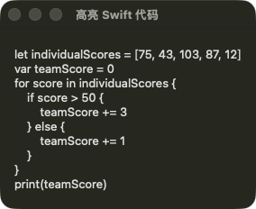
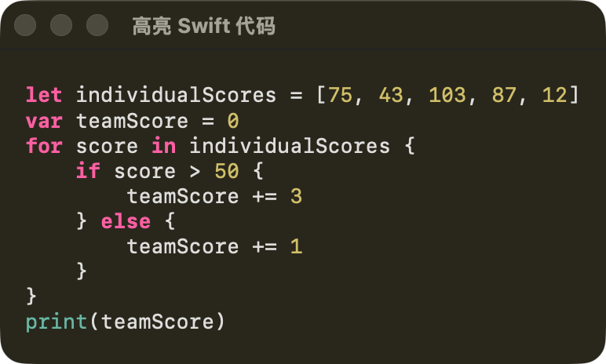

使用 swift-syntax 解析 swift 代码为语法树，从而根据不同的 token 设置不同的高亮颜色。

<GithubInfo
    owner="swiftlang"
    repo="swift-syntax"
/>

## 使用 AttrubtedString 显示 Swift 代码

```swift
struct SwiftCodeView: View {
    @State private var codeString: AttributedString = ""

    var body: some View {
        Text(codeString)
            .padding()
            .onAppear {
                codeString = AttributedString(
                    """
                    let individualScores = [75, 43, 103, 87, 12]
                    var teamScore = 0
                    for score in individualScores {
                        if score > 50 {
                            teamScore += 3
                        } else {
                            teamScore += 1
                        }
                    }
                    print(teamScore)
                    """
                )
            }
    }
}
```




## 使用 swift-syntax 库解析代码字符串

使用 swift-syntax 提供的 Parser 解析代码字符串，并获取其中的 `tokens` 属性：

```swift
let codeString =
    """
    let individualScores = [75, 43, 103, 87, 12]
    var teamScore = 0
    for score in individualScores {
        if score > 50 {
            teamScore += 3
        } else {
            teamScore += 1
        }
    }
    print(teamScore)
    """
let sourceFileSynatx = Parser.parse(source: codeString)
let tokens = sourceFileSynatx.tokens(viewMode: .sourceAccurate)
for token in tokens {
    print("\(token): \(token.tokenKind)")
}
```

```swift
let individualScores = [75, 43, 103, 87, 12]
var teamScore = 0
for score in individualScores {
    if score > 50 {
        teamScore += 3
    } else {
        teamScore += 1
    }
}
print(teamScore)
```

下面是 Parser 生成的 token 及其类型：

```plaintext collapse={5-54}
Optional("swift")
let : keyword(SwiftSyntax.Keyword.let)
individualScores : identifier("individualScores")
= : equal
[: leftSquare
75: integerLiteral("75")
, : comma
43: integerLiteral("43")
, : comma
103: integerLiteral("103")
, : comma
87: integerLiteral("87")
, : comma
12: integerLiteral("12")
]: rightSquare

var : keyword(SwiftSyntax.Keyword.var)
teamScore : identifier("teamScore")
= : equal
0: integerLiteral("0")

for : keyword(SwiftSyntax.Keyword.for)
score : identifier("score")
in : keyword(SwiftSyntax.Keyword.in)
individualScores : identifier("individualScores")
{: leftBrace

    if : keyword(SwiftSyntax.Keyword.if)
score : identifier("score")
> : binaryOperator(">")
50 : integerLiteral("50")
{: leftBrace

        teamScore : identifier("teamScore")
+= : binaryOperator("+=")
3: integerLiteral("3")

    } : rightBrace
else : keyword(SwiftSyntax.Keyword.else)
{: leftBrace

        teamScore : identifier("teamScore")
+= : binaryOperator("+=")
1: integerLiteral("1")

    }: rightBrace

}: rightBrace

print: identifier("print")
(: leftParen
teamScore: identifier("teamScore")
): rightParen
: endOfFile
```

得到了这些信息后，我们就可以根据 `token` 的类型设置不同的样式：

```swift
for token in tokens {
    let color: Color =
        switch token.tokenKind {
        case .keyword:
            Color(
                red: 252 / 255,
                green: 95 / 255,
                blue: 163 / 255
            )
        case .identifier("print"):
            Color(
                red: 103 / 255,
                green: 183 / 255,
                blue: 164 / 255
            )
        case .integerLiteral:
            Color(
                red: 208 / 255,
                green: 191 / 255,
                blue: 105 / 255
            )
        default:
            .primary
        }
    let font: Font =
        switch token.tokenKind {
        case .keyword:
            .system(.headline, design: .monospaced)
        default:
            .system(.body, design: .monospaced)
        }

    let startOffset = code.utf8.index(
        code.startIndex,
        offsetBy: token.position.utf8Offset
    )
    let endOffset = code.utf8.index(
        code.startIndex,
        offsetBy: token.endPosition.utf8Offset
    )
    if let lowerBound = AttributedString.Index(
        startOffset,
        within: highlightedString
    ),
        let upperBound = AttributedString.Index(
            endOffset,
            within: highlightedString
        )
    {
        highlightedString[lowerBound..<upperBound].foregroundColor =
            color
        highlightedString[lowerBound..<upperBound].font = font
    }
}
```

上述代码中的样式参考了 Xcode 默认主题的参数：


