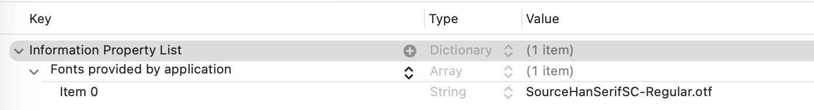
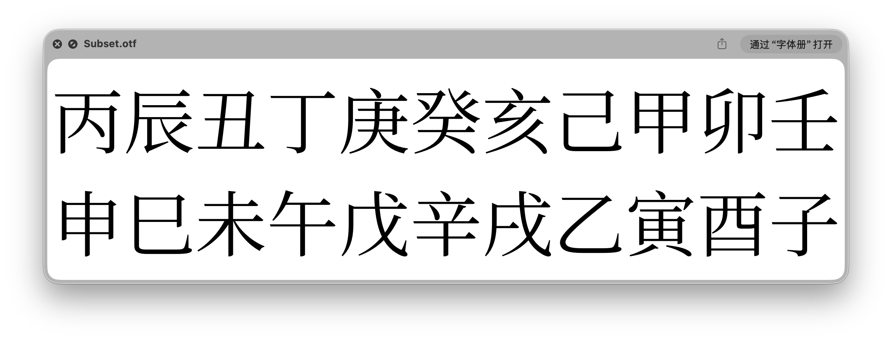

## 使用自定义字体

### 导入自定义字体

直接将字体文件导入项目即可。

### 在 Info.list 中增加 Key

在 Info.list 文件中，增加 Key `Fonts provided by application`，值为字体文件名，注意包括文件拓展名。



### 使用 custom

SwiftUI 提供了类型方法 [`custom(_:size:)`](https://developer.apple.com/documentation/swiftui/font/custom(_:size:)) 用于指定自定义字体：

```swift
.font(
    .custom(
        "SourceHanSerifSC-Regular",
        size: 17,
        relativeTo: .body
    )
)
```

注意此处的字体名称要和你导入项目中的自定义字体文件名称保持一致。

## 字体子集化

字体文件通常会包含上万个字符，体积也会到达 20MB 左右的量级，当应用需要多个字重的字体文件时，会导致包体积到达 100MB 左右，对于一个 iOS 工具类软件来说，这很离谱。

针对这种情况，可以对所用的字体文件进行**子集化**，也就是只提取软件中需要的必要字符对应的字体文件。

### fonttools

本文使用 [fonttools](https://github.com/fonttools/fonttools.git) 完成字体子集化。

命令如下：

```bash
pyftsubset SimplifiedChinese/SourceHanSerifSC-Regular.otf --text-file=text.txt --output-file=Subset.otf
```

此处使用[思源宋体](https://source.typekit.com/source-han-serif/)作为演示，其中文件 text.txt 包含了你所想要保留的字符。

```text title="text.txt"
子丑寅卯辰巳午未申酉戌亥
甲乙丙丁戊己庚辛壬癸
```

可以看见，子集化后的字体文件只包含 text.txt 指定的字符。



## 参考资料

1. [Applying-Custom-Fonts-to-Text](https://developer.apple.com/documentation/SwiftUI/Applying-Custom-Fonts-to-Text)
2. [fontTools Documentation](https://fonttools.readthedocs.io/en/latest/)
