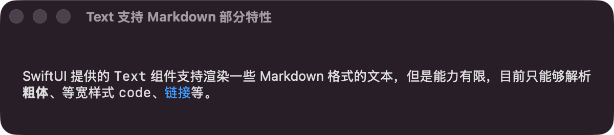
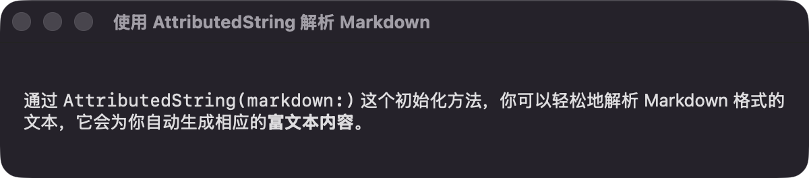
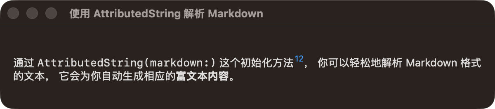

> [!note]
> 需要注意 `AttributedString` 适用于 iOS 15+

使用 `AttributedString`，可以在 SwiftUI 中原生支持 Markdown 文本渲染。

## Text 组件对 Markdown 的有限支持

SwiftUI 提供的 Text 组件对 Markdown 的支持有限，仅支持部分 Markdown 格式，如粗体、斜体、链接等。

```swift {2}
struct InlineMarkdownView: View {
    @State private var string: LocalizedStringKey =
        """
        SwiftUI 提供的 `Text` 组件支持渲染一些 Markdown 格式的文本，但是能力有限，目前只能够解析**粗体**、等宽样式 `code`、[链接](https://swift.org)等。
        """

    var body: some View {
        Text(
            string
        )
        .padding()
    }
}
```



## 使用 AttributedString

对于 Markdown 其他更复杂的格式，可以使用 `AttributedString(markdown:)` 方法进行初始化，从而获得更多的格式支持。

```swift {15}
struct AttributedStirngMarkdownView: View {
    @State private var string: AttributedString = ""

    var body: some View {
        Text(string)
            .padding()
            .onAppear {
                do {
                    let markdown =
                        """
                        通过 `AttributedString(markdown:)` 这个初始化方法，
                        你可以轻松地解析 Markdown 格式的文本，
                        它会为你自动生成相应的**富文本内容**。
                        """
                    string = try AttributedString(markdown: markdown)
                } catch {
                    print("Failed to parse markdown: \(error)")
                }
            }
    }
}
```



通过 `AttributedString` 的 [runs](https://developer.apple.com/documentation/foundation/attributedstring/runs)
属性，可以访问每个文本片段的属性，从而实现更细颗粒度的格式化需求。

```swift {16-29} collapse={1-17, 30-37}
struct AttributedStirngMarkdownView: View {
    @State private var string: AttributedString = ""

    var body: some View {
        Text(string)
            .padding()
            .onAppear {
                do {
                    let markdown =
                        """
                        通过 `AttributedString(markdown:)` 这个初始化方法[^12]，
                        你可以轻松地解析 Markdown 格式的文本，
                        它会为你自动生成相应的**富文本内容**。

                        [^12]: 开发者文档
                        """
                    string = try AttributedString(markdown: markdown)
                    for run in string.runs {
                        guard let link = run.link else { continue }
                        let text = String(string[run.range].characters)
                        guard text.hasPrefix("^") else { continue }

                        var sup = AttributedString(String(text.dropFirst()))
                        sup.link = link
                        sup.font = .footnote
                        sup.baselineOffset = 6

                        string.replaceSubrange(run.range, with: sup)
                    }
                } catch {
                    print("Failed to parse markdown: \(error)")
                }
            }
    }
}
```



## 自定义属性
