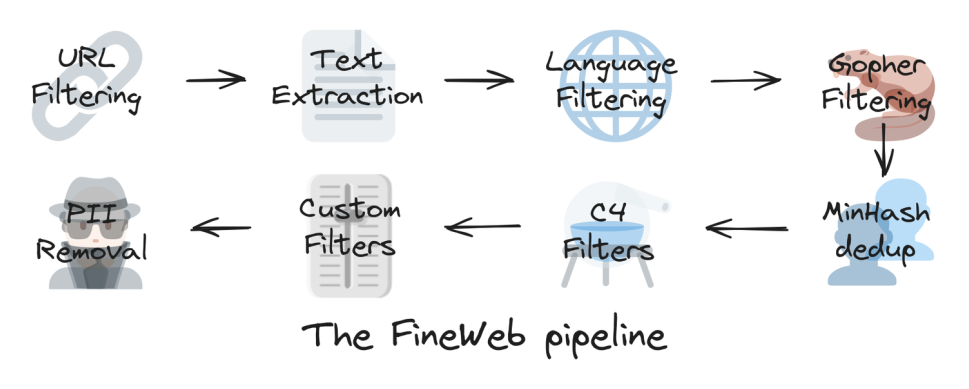
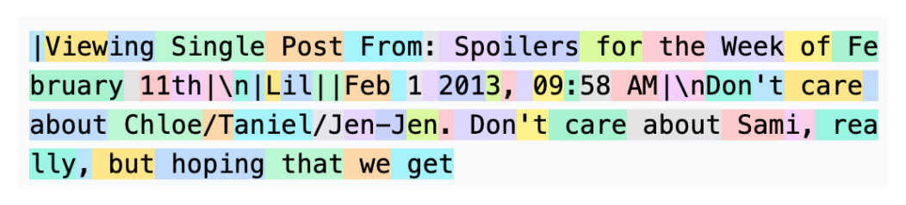
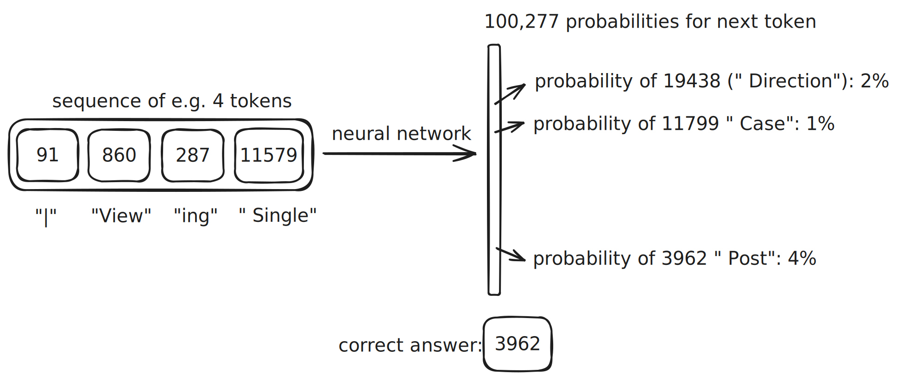

## 预训练

### 下载并预处理互联网资料

参考 [FineWeb 项目](https://huggingface.co/spaces/HuggingFaceFW/blogpost-fineweb-v1)

### 分词

将文本转换为一系列的符号（也叫做词元）

1. 首先处理字节流
2. 然后使用[字节对编码](https://zh.wikipedia.org/wiki/字节对编码)对数据进行压缩，

5000 左右的文本字符串，转换为近 40000 比特数据，转换为近 5000 字节的数据，最后转换为近 1300 个 GPT-4 词元

可以使用[可视化网页](https://tiktokenizer.vercel.app/)理解分词的具体逻辑。

### 训练神经网络

一系列的词元（也可以叫做上下文）作为神经网络的输入（具有不同的权重），内部通过一系列复杂计算，输出下一个词元对应的概率，多次更新词元输入序列，从而不断更新输出词元的概率以拟合所给训练数据的“特征”，从而能够实现输入一个词元后，对下一个词元的预测符合训练数据的“特征”。

#### 神经网络内部原理

神经网络内部原理是通过一系列的神经元（也叫做节点）组成的一系列层（也叫做网络），每个神经元都有一个权重（也叫做参数），神经元的输出是输入的加权和，然后通过激活函数（也叫做非线性函数）进行非线性变换，从而实现非线性拟合。

[LLM 可视化](https://bbycroft.net/llm)

### 推理

推理是通过训练好的神经网络，输入一个词元，输出下一个词元的概率，从而实现输入一个词元后，对下一个词元的预测符合训练数据的“特征”。

### 基础模型

发布的基础模型通常包含两部分：

1. 运行 Transformer 的代码，通常是 200 行左右的 Python 代码。
2. Transformer 的参数，通常为上亿个数。

### 基础模型的心理学

基础模型事实上是一个“词元模拟器”，它能够根据输入的词元，生成下一个词元的概率分布。

模型会更偏向于输出在互联网中大量文档中更常见的词元，因此其输出并不能尽信。

模型输出的 token 是以预测的方式做出的最佳猜测（guess），这就是所谓的幻觉（hallucination）

## 后训练：监督微调
