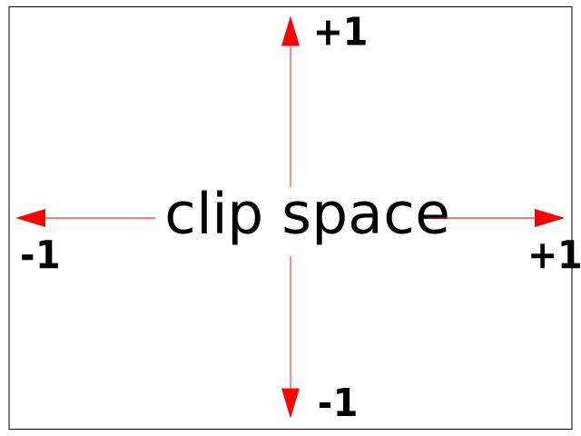
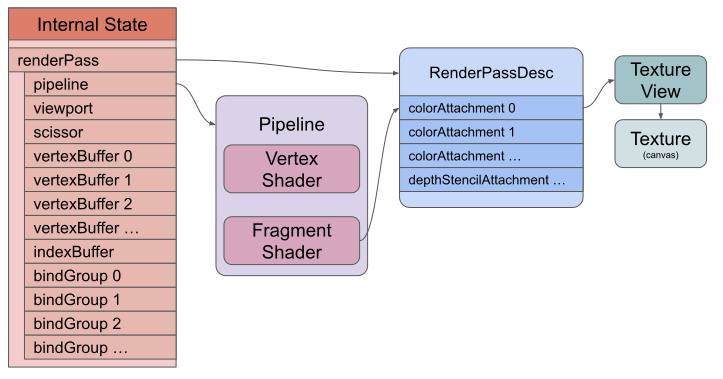
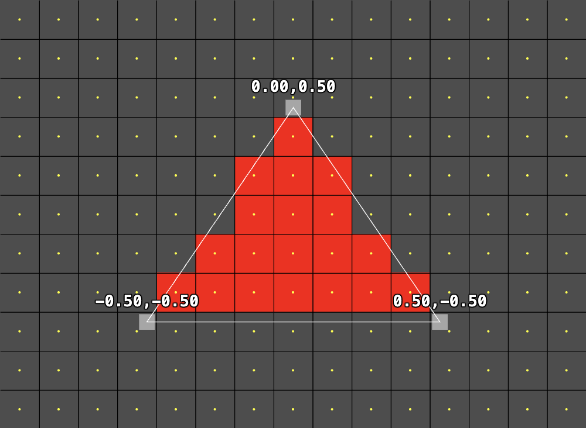
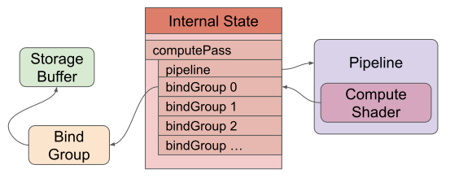

## Introduction

WebGPU exposes three main kinds of shader stages: vertex shaders, fragment shaders, and compute shaders.

A vertex shader computes the position of each vertex.

A fragment shader computes the color of each pixel.

A compute shader runs general-purpose logic across however many invocations you request.

You can think of shaders as functions that are uploaded to the GPU, similar to how you pass a callback to `Array.map()` in JavaScript.


The pipeline describes which vertex and fragment shaders the GPU should run, along with the configuration needed to execute them.

Data flows through the pipeline from attributes, into the vertex shader, and then into the fragment shader.

These resources are connected to shader-visible state through _bind groups_.

The resources shown in the diagram are the minimum set you need to execute shaders on the GPU.

Most WebGPU resources cannot be reconfigured after creation. You can update their contents, but not their size, usage, or format.

To issue work to the GPU, you create commands and record them into command buffers.

A command encoder records those commands into a command buffer.

Once recording is complete, you `finish()` the command buffer and `submit()` it to the GPU queue for execution.

```javascript
encoder = device.createCommandEncoder()
// draw something
{
  pass = encoder.beginRenderPass(...)
  pass.setPipeline(...)
  pass.setVertexBuffer(0, …)
  pass.setVertexBuffer(1, …)
  pass.setIndexBuffer(...)
  pass.setBindGroup(0, …)
  pass.setBindGroup(1, …)
  pass.draw(...)
  pass.end()
}
// draw something else
{
  pass = encoder.beginRenderPass(...)
  pass.setPipeline(...)
  pass.setVertexBuffer(0, …)
  pass.setBindGroup(0, …)
  pass.draw(...)
  pass.end()
}
// compute something
{
  pass = encoder.beginComputePass(...)
  pass.beginComputePass(...)
  pass.setBindGroup(0, …)
  pass.setPipeline(...)
  pass.dispatchWorkgroups(...)
  pass.end();
}
commandBuffer = encoder.finish();
```

```javascript
device.queue.submit([commandBuffer]);
```

Calling `draw()` updates the current GPU state and tells the GPU to run the vertex shader, which in turn leads to fragment shading for the covered pixels.

Calling `dispatchWorkgroups()` tells the GPU to execute a compute shader.

## Drawing triangles to textures

On the web, a `<canvas></canvas>` element can be used as a rendering target in WebGPU.

To draw triangles, you need at least two shaders: a vertex shader and a fragment shader.

The vertex shader computes the positions of the triangle's vertices.

The fragment shader computes the color of each pixel that ends up on the screen.

Because WebGPU is asynchronous, it is typically used inside an async function.

```javascript
async function main() {
  const adapter = await navigator.gpu?.requestAdapter();
  const device = await adapter?.requestDevice();
  if (!device) {
    fail('need a browser that supports WebGPU');
    return;
  }
}
main();
```

This code requests an adapter and then a device from the browser's WebGPU implementation. If no suitable device is available, it shows an error.

Next, we look up the canvas element and create a WebGPU context.

```javascript
// Get a WebGPU context from the canvas and configure it
const canvas = document.querySelector('canvas');
const context = canvas.getContext('webgpu');
const presentationFormat = navigator.gpu.getPreferredCanvasFormat();
context.configure({
  device,
  format: presentationFormat,
});
```

Here, `device` and `presentationFormat` are passed to `configure()` so the canvas knows how WebGPU should render into it.

Next, we create a shader module.

```javascript
const module = device.createShaderModule({
  label: 'our hardcoded red triangle shaders',
  code: /* wgsl */ `
    @vertex fn vs(
      @builtin(vertex_index) vertexIndex : u32
    ) -> @builtin(position) vec4f {
      let pos = array(
        vec2f( 0.0,  0.5),  // top center
        vec2f(-0.5, -0.5),  // bottom left
        vec2f( 0.5, -0.5)   // bottom right
      );

      return vec4f(pos[vertexIndex], 0.0, 1.0);
    }

    @fragment fn fs() -> @location(0) vec4f {
      return vec4f(1.0, 0.0, 0.0, 1.0);
    }
  `,
});
```

This shader module contains the source code for both the vertex shader and the fragment shader.

---

Shaders in WebGPU are written in WGSL, the WebGPU Shading Language, which is a strongly typed language designed specifically for GPU programming.

The `vs` function is the vertex shader, identified by the `@vertex` attribute.

```wgsl
@vertex fn vs(
  @builtin(vertex_index) vertexIndex : u32
) -> @builtin(position) vec4f {
    let pos = array(
      vec2f( 0.0,  0.5),  // top center
      vec2f(-0.5, -0.5),  // bottom left
      vec2f( 0.5, -0.5)   // bottom right
    );

    return vec4f(pos[vertexIndex], 0.0, 1.0);
}
```

`vertexIndex` is a `u32` value provided by the GPU through the `@builtin(vertex_index)` attribute.

The GPU automatically increments `vertex_index` for each vertex being processed.

If you draw `n` vertices, `vertex_index` ranges from `0` to `n - 1`.

The `vs` function returns a `vec4f` value representing the vertex position in clip space, and that value is assigned to the `@builtin(position)` output.

`vec4f` is a four-component 32-bit floating-point vector in WGSL, conceptually similar to `{ x: 0, y: 0, z: 0, w: 0 }`.

Positions returned by the vertex shader are expressed in _clip space_, where the X axis ranges from `-1` to `1` and the Y axis also ranges from `-1` to `1`.



The main logic of `vs` defines an array of three `vec2f` values, each storing the `x` and `y` coordinates of one vertex. It then converts the selected `vec2f` into a `vec4f` by supplying `0.0` for `z` and `1.0` for `w`.

That means all three vertices share the same `z` and `w` values. Since this example draws a 2D triangle, `z` is not used for meaningful depth here, and `w` remains `1.0` so no perspective scaling is applied.

The fragment shader is declared with the `@fragment` attribute:

```wgsl
@fragment fn fs() -> @location(0) vec4f {
  return vec4f(1.0, 0.0, 0.0, 1.0);
}
```

The return value is assigned to `@location(0)`, which is the first color output location.

The `vec4f` return value contains the RGBA color for the fragment, corresponding to red, green, blue, and alpha respectively.

This shader simply outputs a solid red color for every fragment.

The fragment shader will be executed, when the GPU _rasterizes_ the triangle.

Label everything you make with WebGPU, because it will be printed when you get an error.

---

Create a render pipeline:

```javascript
const pipeline = device.createRenderPipeline({
  label: 'our hardcoded red triangle pipeline',
  layout: 'auto',
  vertex: {
    entryPoint: 'vs',
    module,
  },
  fragment: {
    entryPoint: 'fs',
    module,
    targets: [{ format: presentationFormat }],
  },
});
```

The `layout` option is set to `'auto'`, which means to ask WebGPU to derive the layout of data from the shaders.

And then, use the `vs` and `fs` shader from module to define the pipeline.

If only one function of the corresponding type each shader stage, the `entryPoint` option can be omitted.

---

```javascript
const renderPassDescriptor = {
  label: 'our basic canvas renderPass',
  colorAttachments: [
    {
      // view: <- to be filled out when we render
      clearValue: [0.3, 0.3, 0.3, 1],
      loadOp: 'clear',
      storeOp: 'store',
    },
  ],
};
```

The code above create a `GPURenderPassDescriptor` that describes the render pass to be executed.

The `loadOp` option set to `'clear'`, which means to clear the color attachment to the `clearValue` before rendering.
The `storeOp` option set to `'store'`, which means to store the rendered color attachment to the texture.

Because we use `@location(0) vec4f` as `fs` function return value, the `colorAttachments` only has one element.

---

```javascript
function render() {
  // Get the current texture from the canvas context and
  // set it as the texture to render to.
  renderPassDescriptor.colorAttachments[0].view =
      context.getCurrentTexture().createView();

  // make a command encoder to start encoding commands
  const encoder = device.createCommandEncoder({ label: 'our encoder' });

  // make a render pass encoder to encode render specific commands
  const pass = encoder.beginRenderPass(renderPassDescriptor);
  pass.setPipeline(pipeline);
  pass.draw(3);  // call our vertex shader 3 times
  pass.end();

  const commandBuffer = encoder.finish();
  device.queue.submit([commandBuffer]);
}

render();
```

Call `context.getCurrentTexture().createView()` to get the current texture view and set it as the color attachment view.

Then, create a `commandBuffer` by finishing the encoder and submit it to the queue.

Next, use command encoder to create a render pass encoder by calling `beginRenderPass`.

Tell command encoder to execute the vertex shader 3 times by calling `draw(3)`.

Finally, end the render pass by calling `pass.end()`, and finish the command encoder by calling `encoder.finish()`.

The result of `encoder.finish()` needs to be submitted to the queue via `device.queue.submit()`.



<CodeSandbox
  src="https://codesandbox.io/embed/3wc73r?view=preview&module=%2Fsrc%2Findex.js&hidenavigation=1"
  title="admiring-paper-thdz7t"
  height={500}
/>

The methods like `setPipeline` and `draw` only add commands to the command buffer, they do not execute them immediately until the command buffer is submitted to the queue.

---

WebGPU takes all vertexs from vertex shaders to rasterize a triangle, it determines which pixel's center are inside the triangle and writes the color(fragment shader output) to those pixels.



**Take ways:**

- WebGPU just runs shaders.
- Shaders are specified in a shader module.
- WebGPU draws to textures.
- WebGPU works by encoding commands and then submitting them.

## Run computations on the GPU

```javascript
async function main() {
    const adapter = await navigator.gpu?.requestAdapter();
    const device = await adapter?.requestDevice();
    if (!device) {
        fail("need a browser that supports WebGPU");
        return;
    }

    const module = device.createShaderModule({
        label: "doubling compute module",
        code: /* wgsl */ `
  @group(0) @binding(0) var<storage, read_write> data: array<f32>;

  @compute @workgroup_size(1) fn computeSomething(
    @builtin(global_invocation_id) id: vec3u
  ) {
    let i = id.x;
    data[i] = data[i] * 2.0;
  }
`,
    });
}
```

`storage` is a type, the `read_write` describes the access mode of the binding, which allows the binding to be read from and written to by the shader.

`@group(0) @binding(0)` specifies the data on binding 0 in binding group 0.

Use `@compute` attribute to make a function as a compute shader.

Compute shaders required a `@workgroup_size` attribute to specify the number of threads in each workgroup.

`vec3u` is a 3-component unsigned 32-bit integer vector type.

---

Create a pipeline for the compute shader.

```javascript
const pipeline = device.createComputePipeline({
    label: 'doubling compute pipeline',
    layout: 'auto',
    compute: {
      module,
    },
  });
```

The same as above `vertex` and `fragment` options.

---

Now, we need pass a int array to the compute shader, so we create a buffer and copy the data into it.

```javascript
const input = new Float32Array([1, 3, 5]);

// create a buffer on the GPU to hold our computation
// input and output
const workBuffer = device.createBuffer({
  label: 'work buffer',
  size: input.byteLength,
  usage: GPUBufferUsage.STORAGE | GPUBufferUsage.COPY_SRC | GPUBufferUsage.COPY_DST,
});
// Copy our input data to that buffer
device.queue.writeBuffer(workBuffer, 0, input);
```

The WebGPU buffer have to set `usage` to specify how the buffer will be used.

In this case, we use `GPUBufferUsage.STORAGE` to allow the buffer to be used as a storage buffer,
`GPUBufferUsage.COPY_SRC` to allow the data to be copied from the buffer, and `GPUBufferUsage.COPY_DST` to allow the data to be copied to the buffer.

---

We can not directly read from buffer in the JavaScript, because some buffers only exist on the GPU.

So we need to create a result buffer to map the output data.

```javascript
// create a buffer on the GPU to get a copy of the results
const resultBuffer = device.createBuffer({
    label: "result buffer",
    size: input.byteLength,
    usage: GPUBufferUsage.MAP_READ | GPUBufferUsage.COPY_DST,
});
```

The above buffer is created with `GPUBufferUsage.MAP_READ` so we can map it to read the results from the GPU.

---

Next, we create a bind group to bind the input and output buffers to the compute pipeline.

```javascript
// Setup a bindGroup to tell the shader which
// buffer to use for the computation
const bindGroup = device.createBindGroup({
    label: "bindGroup for work buffer",
    layout: pipeline.getBindGroupLayout(0),
    entries: [{ binding: 0, resource: workBuffer }],
});
```

The `{binding: 0 ...` of the entries corresponds to the `@group(0) @binding(0)` in the shader.

---

Finally, we create a compute pass to dispatch the compute shader.

```javascript
// Encode commands to do the computation
const encoder = device.createCommandEncoder({
    label: "doubling encoder",
});
const pass = encoder.beginComputePass({
    label: "doubling compute pass",
});
pass.setPipeline(pipeline);
pass.setBindGroup(0, bindGroup);
pass.dispatchWorkgroups(input.length);
pass.end();
```

The `dispatchWorkgroups` call tells the GPU how many workgroups to dispatch, and in this case, we pass `input.length`.



---

```javascript
// Encode a command to copy the results to a mappable buffer.
encoder.copyBufferToBuffer(
    workBuffer,
    0,
    resultBuffer,
    0,
    resultBuffer.size,
);

// Finish encoding and submit the commands
const commandBuffer = encoder.finish();
device.queue.submit([commandBuffer]);

// Read the results
await resultBuffer.mapAsync(GPUMapMode.READ);
const result = new Float32Array(resultBuffer.getMappedRange());

console.log("input", input);
console.log("result", result);

resultBuffer.unmap();
```

After the computation is done, use `mapAsync` to read the results from the buffer.

The `getMappedRange` returns a value and only works until `unmap` is called.

<CodeSandbox
  src="https://codesandbox.io/embed/mhv95p?view=preview&module=%2Fsrc%2Findex.js&hidenavigation=1&expanddevtools=1"
  title="admiring-paper-thdz7t"
  height={500}
/>

## Simple Canvas Resizing

```html
<style>
html, body {
  margin: 0;       /* remove the default margin          */
  height: 100%;    /* make the html,body fill the page   */
}
canvas {
  display: block;  /* make the canvas act like a block   */
  width: 100%;     /* make the canvas fill its container */
  height: 100%;
}
</style>
```

The `style` tag above ensures the canvas fills the entire viewport.

But you will see that the triangle's edges are not smooth.

The `canvas` tag have a resolution of 300x500 pixels by default, so we need to scale it up.

We can use [`ResizeObserver`](https://developer.mozilla.org/en-US/docs/Web/API/ResizeObserver) to listen for changes to the canvas size and scale it up.

```javascript
render(); // [!code --]
const observer = new ResizeObserver(entries => {
  for (const entry of entries) {
    const canvas = entry.target;
    const width = entry.contentBoxSize[0].inlineSize;
    const height = entry.contentBoxSize[0].blockSize;
    canvas.width = Math.max(1, Math.min(width, device.limits.maxTextureDimension2D));
    canvas.height = Math.max(1, Math.min(height, device.limits.maxTextureDimension2D));
  }
  // re-render
  render();
});
observer.observe(canvas);
```

The largest size of canvas supported by the device is `device.limits.maxTextureDimension2D`.
The smallest size can not go to zero.
