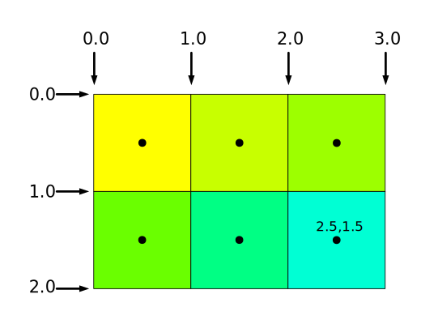

阶段间变量是在 GPU 渲染管线中，从一个 shader 阶段传递到下一个阶段的变量。

```wgsl
struct OurVertexShaderOutput {
  @builtin(position) position: vec4f,
  @location(0) color: vec4f,
};
```

The `struct` coordinates the inter-stage variables between the vertex and fragment shaders.

Now, we change the vertex shader output as a struct.

```wgsl
@vertex fn vs(
  @builtin(vertex_index) vertexIndex : u32
) -> @builtin(position) vec4f { // [!code --]
) -> OurVertexShaderOutput {    // [!code ++]
  let pos = array(
    vec2f( 0.0,  0.5),  // top center
    vec2f(-0.5, -0.5),  // bottom left
    vec2f( 0.5, -0.5)   // bottom right
  );
  var color = array<vec4f, 3>(
    vec4f(1, 0, 0, 1), // red
    vec4f(0, 1, 0, 1), // green
    vec4f(0, 0, 1, 1), // blue
  );

  var vsOutput: OurVertexShaderOutput;
  vsOutput.position = vec4f(pos[vertexIndex], 0.0, 1.0);
  vsOutput.color = color[vertexIndex];
  return vsOutput;
}
```

The vertex shader now returns a `OurVertexShaderOutput` struct, which contains the `position` and `color` fields.

When the fragment shader receives this struct:

```wgsl
@fragment fn fs(fsInput: OurVertexShaderOutput) -> @location(0) vec4f {
  return fsInput.color;
}
```

阶段间变量会自动执行插值，因此可以看见三角形三个顶点为设置的颜色，然后中间部分为有过渡效果的渐变：

<CodeSandbox
  src="https://codesandbox.io/embed/zjqymm?view=preview&module=%2Findex.html&hidenavigation=1"
  title="webgpu-inter-stage-variables-triangle"
  height={500}
/>


## 通过 `location` 连接阶段间变量

The connection between vertex shader and fragment shader is by index, and the inter-stage variables is by location index.

So, use the `@location(0)` change struct still works.

```wgsl
@fragment fn fs(@location(0) color: vec4f) -> @location(0) vec4f {
  return color;
}
```

## `@builtin(position)`

```wgsl
struct OurVertexShaderOutput {
  @builtin(position) position: vec4f, // [!code highlight]
  @location(0) color: vec4f,
};
```

`OurVertexShaderOutput` 定义中的 `@builtin(position)` 字段是一个 `builtin` 变量。

定义在顶点着色器和片元着色器中的 `@builtin(position)` 意义不相同，在顶点着色器中，`@builtin(position)` 输出的是 GPU 用来绘制图形的坐标点，
而在片元着色器中，输入 `@builtin(position)` 表示当前片元着色器计算颜色值的像素坐标。

---

像素坐标通过像素边缘指定，提供给片元着色器的坐标是每个像素点的中心坐标。



通过修改片元着色器，实现棋盘效果：

```wgsl
@fragment fn fs(fsInput: OurVertexShaderOutput) -> @location(0) vec4f {
  let red = vec4f(1, 0, 0, 1);
  let cyan = vec4f(0, 1, 1, 1);

  let grid = vec2u(fsInput.position.xy) / 8;
  let checker = (grid.x + grid.y) % 2 == 1;

  return select(red, cyan, checker);
}
```

`fsInput.position` 是一个内建的位置参数，使用其 `xy` 属性可以获取当前片元位置，然后将其转换为 `vec2u` 类型进行棋盘计算。

将上述位置除以 `8` 实现一个格子占 8x8 像素的效果。

`select` 函数根据条件选择前两个参数中的一个返回。

---

即使你不使用 `@builtin(position)`，也可以通过其他方式在片元着色器中获取当前片元的位置，例如通过纹理坐标等。
